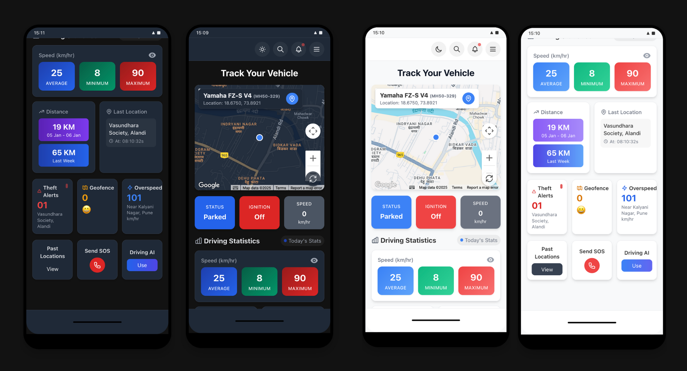
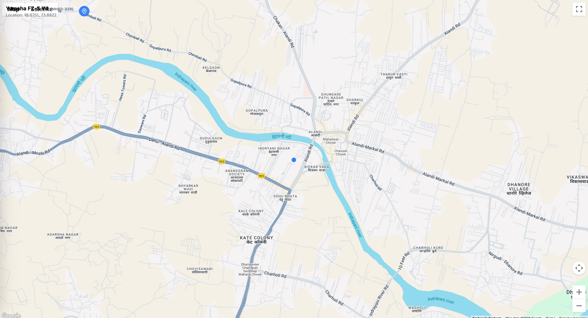
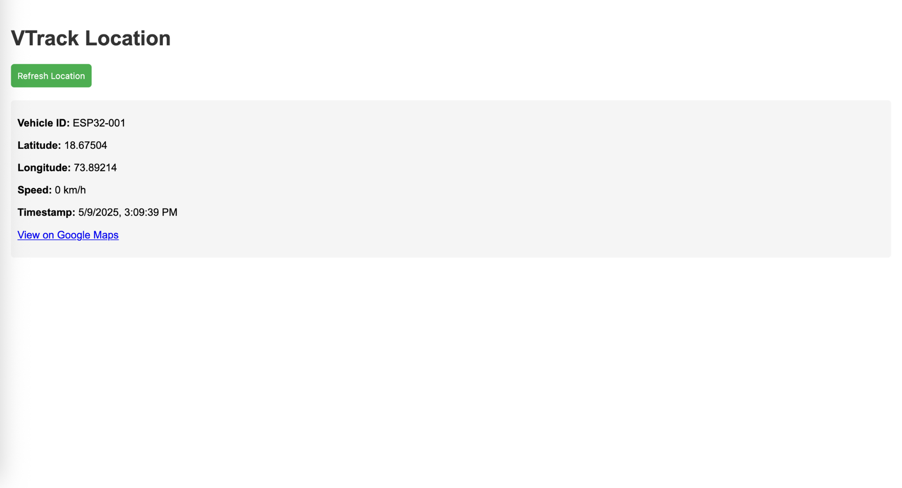
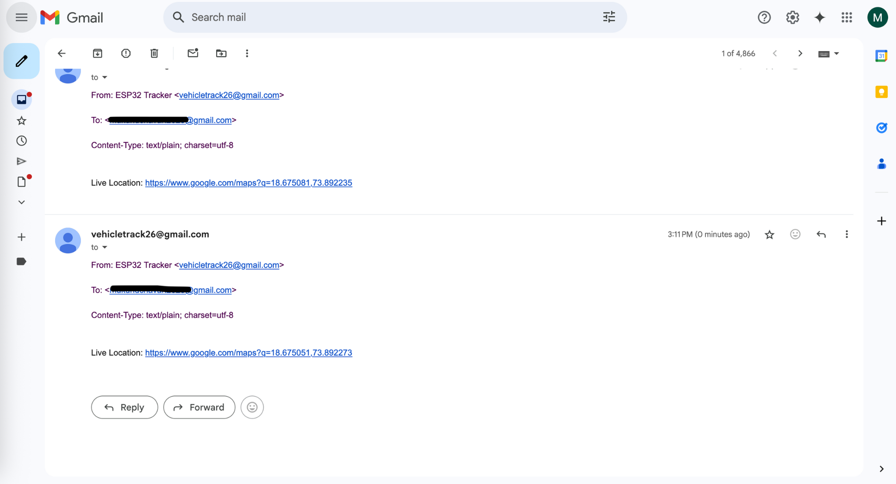
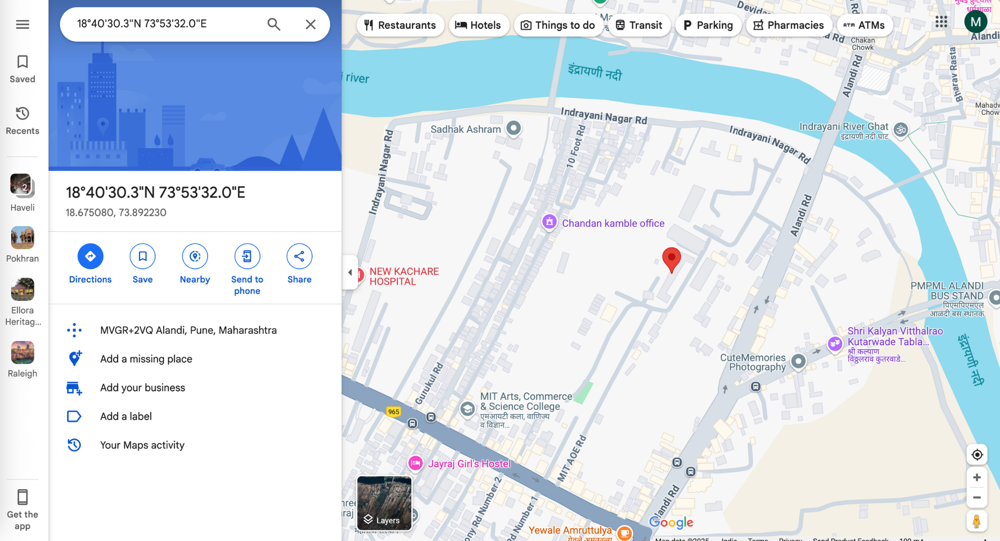

# 🚗 VTrack – Real-Time Vehicle Tracking System

> **Track smarter. Move safer.**
A real-time vehicle tracking web application inspired by platforms like Uber/Ola. VTrack allows you to visualize and monitor vehicles on a map with live updates, smart alerts, and insightful driving statistics.

---
## 🗺️ Main Homepage (Showing Tracking Map)


## ╰┈➤ Embedded HTML Map


## </> Backend Server (Flask)


## 📩 SMTP based Email Alerts (Link)


## 📍 Live location link through Google Maps



---

## ✨ Features

- 📍 **Live Location Tracking** – Real-time GPS location updates on Google Maps
- 🚘 **Vehicle Monitoring** – Check speed, movement status (moving/parked), and direction (static)
- 📊 **Driving Stats** – Monitor speed, distance traveled, and activity logs (static)
- 🚨 **Smart Alerts** – Theft detection, overspeed warnings, and geofence breach alerts (static)
- 🔌 **ESP32 Hardware Integration** – Collects and transmits GPS data to the system

---

## 🛠️ Tech Stack

| Layer        | Tech Used                                      |
|--------------|-----------------------------------------------|
| **Frontend** | React, Tailwind CSS, Google Maps API          |
| **Backend**  | Flask (Python)                                |
| **Real-Time**| HTTP Polling                                  |
| **Hardware** | ESP32 Microcontroller with Google Geolocation |

---

## 📁 Project Structure

```
vtrack/
├── public/                  # Static files
├── src/                     # Frontend React application
│   ├── assets/              # Images, icons, etc.
│   ├── components/          # React components
│   │   ├── map/             # Map-related components
│   │   └── ui/              # UI components
│   ├── context/             # Context providers (e.g., ThemeContext)
│   ├── pages/               # Page components
│   └── services/            # API and location polling services
├── map-test.html            # Standalone map implementation
├── server.py                # Flask backend server
└── docker-compose.yml       # Docker configuration

```

## 🚀 Getting Started

### ✅ Prerequisites

- Node.js (v18 or later)
- Python 3.8+ (for Flask backend)
- Google Maps API key
- Docker and Docker Compose (for containerized setup)


### 🧩 Installation

1. Clone the repository:
   ```
   git clone <repository-url>
   cd vtrack
   ```

2. Install frontend dependencies:
   ```
   npm install
   ```

3. Install backend dependencies:
   ```
   pip install flask flask-cors
   ```

4. Add your Google Maps API key in `map-test.html`


### ▶️ Run the Application

#### Option 1: 🐳 Docker (Recommended)

This project is configured to run in an isolated Docker container to prevent version conflicts with other projects.

1. Build and start the frontend container:
   ```bash
   docker-compose up -d
   ```

2. Start the map server:
   ```bash
   python -m http.server 8000
   ```

3. Start the Flask backend server:
   ```bash
   python server.py
   ```

4. Access the application at:
   ```
   http://localhost:5500
   ```

5. To stop the container:
   ```bash
   docker-compose down
   ```

#### Option 2: 🧪 Running Locally

1. Start the frontend development server:
   ```
   # In the root directory
   npm run dev -- --port 5500
   ```

2. Start the map server:
   ```bash
   python -m http.server 8000
   ```

3. Start the Flask backend server:
   ```bash
   python server.py
   ```

## 📡 ESP32 Hardware Integration

The application works with ESP32 microcontrollers that send location data using Google's Geolocation API. The ESP32 device connects to WiFi and sends HTTP requests to the Flask backend server with location coordinates.

### ESP32 Configuration Requirements

- WiFi SSID
- Server IP
- Google Geolocation API Key

## 🔮 Future Enhancements

- 🔐 User authentication and vehicle management
- 🤖 AI-based theft detection and driver behavior analysis
- 📱 Mobile app (React Native or Flutter)
- 📍 Geofence boundary alerts
- ⏪ Historical route playback
- 🚧 Admin dashboard for managing multiple vehicles
- 🗺️ Fullscreen map view

## 📄 License

[MIT](LICENSE)

Made with ❤️ by Mukund Chavan and team
